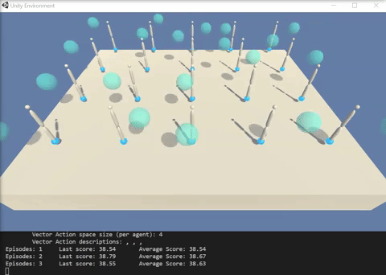
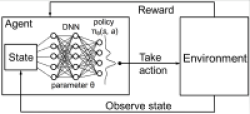
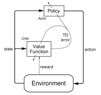
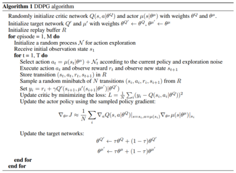
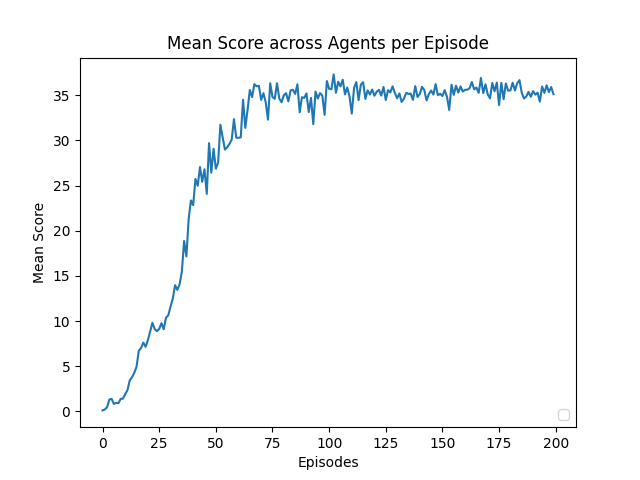

# Reacher Unity environment solution Report
# Udacity Reinforcement Learning Nanodegree Project 2: Continuous Control

This project implements a DDPG agent to how to control a double jointed arm to stay within a moving sphere.

## Environment particularities
<p align="center">
  
</p>
Reacher is an environment in which 20 agents control a double-jointed arm each, allowing the agent to move the tip of the arm in all 3 axis. The target (goal location) is moving and each agent receives a reward of +0.1 for each step that the agent's hand is in the goal location. Thus, the goal of each agent is to maintain it's position at the target location for as many time steps as possible.

The environment state is represented by 33 variables corresponding to position, rotation, velocity, and angular velocities of the two arm rigid bodies. The actions are 4 variables that are continuous and not discrete, corresponding to the torque to be applied to the two joints. As the actions are continuous (-1.0, 1.0), this problem is a continuous control problem, and we have solved it with a deep deterministic policy gradient (DDPG) algorithm.

## Reinforcement Learning and Policy Gradient methods background

Reinforcement learning (RL) is one of the three basic machine learning paradigms, together with supervised learning and unsupervised learning. Whereas both supervised and unsupervised learning are concerned with finding an accurate system to predict an output given inputs, RL focuses on Markov Decision Processes (MDPs) and is concerned with the transition from states to states and the reward/cost associated with these transitions.  
This environment/agent interaction is depicted in below figure:
<p align="center">
  
</p>


Basically, the agent and environment interact in a sequence of discrete time steps t. At each time step t, the agent receives some representation of the environment's state, S<sub>t</sub>&#8712;S, and on that basis selects an action, A<sub>t</sub>&#8712;A(S). At the next timestep t+1, in part as a consequence of its action, the agent receives a scalar reward, R<sub>t+1</sub>&#8712;&#8477;, as well as an new state S<sub>t+1</sub>. The MDP and agent together create a trajectory from an initial time step t over n transitions of states,actions,rewards, and next states as follows:


We represent the sum of rewards accumulated over a trajectory as . Clearly the limit of G<sub>t</sub> as the trajectory steps n increase is unbounded, so to make sure that we can have a bounded maximum total reward, we discount the rewards from the next transaction by a factor &gamma;&#8712;(0,1] with the case of γ=1 being useful only when a task is episodic, ie with a fixed number of transitions.
In the case that the sets S,R,and A are finite, then the MDP is finite and the following hold:
* Random variables  have well defined discrete probability distributions **depending only on the preceding state  & action **
* Given a random state s' ∈ S and reward r ∈ R the probability of s' and r occuring at time t given a preceding state s and action a is given by the four argument MDP <strong>dynamics function</strong> 
  
* Namely, given a state s and an action a, a probability can be assigned to reaching a state s' and receiving reward r, however the sum of these probabilities over all the possible next states and rewards is 1. That is:
  * 

From the <em>dynamics</em> function <em>**p**</em> we can derive other useful functions:
* <em>state transition probabilities</em> : 
* <em>expected rewards</em>: 

We define a policy, ), as a function  that produces an action a given a state s. Thus the expected rewards at a state s can be expressed as =r(s,\pi(s))=\mathbb{E}[R_t|S_{t-1}=s,A_{t-1}=\pi(s)]). This allows us to define the action-value function ), which defines the value of taking action a in state s under the policy π, and continuing the trajectory by taking following the policy π as follows:

[comment]: <> (%2B is plus sign)
[comment]: <> (%0A is line feed, %26 is &)


A fundamental property of the action value function is that it satisfies recursive relationships. That is, for any policy  and any state , the following consistency holds between the action value of ) and the action value of ():


The sum of probabilities over all possible next states s' and rewards r reflects the stochastisticy of the system. If we focus on a specific time-step t, then we can reformulate this with bootstrapping as follows:


When  is approximated as a non-linear function with a neural network with parameters θ, then we denote the action-value function as .
### Q - learning
In Q-learning, we consider that π is an optimal policy, that selects the next action based on the maximum q value of the future state. We learn the parameters of  through gradient descent, trying to fit the above function for a Bellmann error of 0. With a learning rate  the formula and gradient is thus:


### Deep Q Learning Networks
Mnih et al., in their [DQN](https://web.stanford.edu/class/psych209/Readings/MnihEtAlHassibis15NatureControlDeepRL.pdf) paper, used deep neural networks as a function approximator for the above Q-Learning.
Specifically, two Q-networks are trained by minimising a sequence of loss functions ) that changes at each iteration i. One Q-network has parameters  and is actively learning, while the second, target, Q-network has parameters  and it's parameters are gradually updated with the online's parameters. The loss function is thus:


With the above refresher and definitions, we can move to the presentation of the algorithm implemented.
### Deep Deterministic Policy Gradient

in the [DDPG](https://arxiv.org/abs/1509.02971) paper, Lillicrap et. al define an actor-critic method to train an agent on a continuous action space.

Finding the optimal policy with Q-learning is not trivial on continuous action spaces, since we would need to optimize the selected action at every timestep, requiring computation that will slow down our algorithm.
Instead, in [policy gradient methods](http://proceedings.mlr.press/v32/silver14.pdf?CFID=6293331&CFTOKEN=eaaee2b6cc8c9889-7610350E-DCAB-7633-E69F572DC210F301), the actor uses a learned policy function approximator  to select the best action. Learning what action is best given a state is done by maximizing the Q value for the state. Assuming we are sampling actions from a behavior  the objective of the actor becomes:


And the gradient wrt θ becomes:


In the actor-critic setting, critic learns the state value and the state action pair value. This is used to improve the actor (acting as a critic), as depicted in below figure:
<p align="center">
  
</p>


Using a experience replay buffer and having two separate actor-critic networks (one being the target), the DDPG algorithm is as follows:



### Implementation details
In this project, we made the following modifications to the above algorithm:
1. **Noise Process**: Noise is added for each agents' action through a standard Normal distribution sampling. The noise contribution to an action is calculated as follows (with the `eps` factor decaying during training):
   ```python
   if add_noise:
        action = (1-self.eps)*action \
                    + self.eps*np.random.default_rng().standard_normal(size=(self.num_agents, self.action_size))
   ```
2. **Replay buffer**: Instead of sampling stochastically from a replay buffer, we implemented a [Prioritized Experience Replay](https://arxiv.org/pdf/1511.05952.pdf) solution.
3. **n step returns**: As the rewards to an agent are not immediate, to speed up training, an n-step return calculation was implemented.


### Neural network architecture

#### Actor Network
The actor is a function approximator from the observation received by the agent (33 floating point values) to an action (4 floating point values).
We use a deep neural net to approximate this, with the following characteristics:

Below is the summary for the actor network. On the hidden layers we use the `leaky_relu` activation function. On the outputs we use `tanh` to produce actions that are in the desired range -1.0 to 1.0.

| Layer | Type | Input | Output | Activation Fn | Parameters
------------ | ------------- | ------------- | ------------- | ------------- | -------------
layer_1 | Fully Connected | state (33x1) | 128 | None | 4352 (33x128 + 128 bias)
bn1 | BatchNorm | 128 | 128 | `leaky_relu` | 512
layer_2 | Fully Connected | 128 | 128 |`leaky_relu` | 16512 (128x128 + 128 bias)
layer_3 | Fully Connected | 128 | 4 | `tanh` | 516 (128x4 + 4 bias)
|||||| **21892 total**


#### Critic network
The actor is a function approximator from the current state of the game and agent actions to a state action value (1 floating point value).

After running the **state** through a first layer of abstraction (`state_fc`) and normalizing, we concatenate the agent **actions** to produce the input to our `value_fc1` layer

Below is the summary for the critic network. On the hidden layers we use the `leaky_relu` activation function. At the output layer we have no activation funtion.

| Layer | Type | Input | Output | Activation Fn | Parameters
------------ | ------------- | ------------- | ------------- | ------------- | -------------
state_fc | Fully Connected | state (33) | 128 | None | 4352 (33x128 + 128 bias)
bn1 | BatchNorm | 128 | 128 | `leaky_relu` | 512
value_fc1 | Fully Connected | 128 + action(4) | 128 |`leaky_relu` | 17024 (132x128 + 128 bias)
output_fc | Fully Connected | 128 | 1 | None | 129 (128x1 + 1 bias)

|||||| **22017 total**

## Training parameters
The following parameters were used for training:
|Parameter | command line flag | Value
|---------- | ----------------- | -----
|**Training**
|episodes |`--episodes`|200
|batch size | `--batch-size`|128
|Network update rate |`--tau`|0.001
|**Noise**
|Starting Noise factor | `--eps_start` |0.99
|Minimum Noise factor |  |0.001
|Noise factor decay rate |`--eps_decay` |0.9995
|**Prioritized Experience Replay**
|buffer size ||1'000'000
|n steps |`--n_steps`|5
|reward discount rate |`--gamma`|0.99
|α factor (prioritization) for Prioritized Replay Buffer|`--PER_alpha`|0.6
|starting β factor (randomness) for Prioritized Replay Buffer|`--PER_beta_min`|0.4
|ending β factor (randomness) for Prioritized Replay Buffer|`--PER_beta_max`|1.0
|minimum priority to set when updating priorities|`--PER_minimum_priority`|1e-5
|**Actor**
|activation fn||`leaky_relu`
|output activation fn||`tanh`
|Optimizer||`Adam`
|Learning rate||0.0001
|**Critic**
|activation fn||`leaky_relu`
|output activation fn||None
|Optimizer||`Adam`
|Learning rate||0.0001

## Results - Plot of Rewards
With the above parameters, the agent was able to solve the game (average reward over 100 episodes >30) in 30 episodes.


Below is the reward per episode (mean reward across 20 agents).



The environment was solved in 24 episodes (ie from episode 24 onwards, the average score over 100 episodes was 30.12), or **alternatively** it was solved in 124 episodes (by episode 124 the average over the previous 100 episodes was 30.12).
Below the training log:
```text
Episodes: 10    Average Score: 0.90              Score: 1.41
Episodes: 20    Average Score: 2.91              Score: 7.15
Episodes: 30    Average Score: 5.06              Score: 10.64
Episodes: 40    Average Score: 7.84              Score: 23.36
Episodes: 50    Average Score: 11.52             Score: 29.08
Episodes: 60    Average Score: 14.55             Score: 30.32   
Episodes: 70    Average Score: 17.31             Score: 36.05   
Episodes: 80    Average Score: 19.48             Score: 34.23   
Episodes: 90    Average Score: 21.21             Score: 34.71   
Episodes: 100   Average Score: 22.53             Score: 36.58   
Episodes: 110   Average Score: 26.03             Score: 34.86   
Episodes: 120   Average Score: 29.07             Score: 35.64   
Episode 124      Frame: 1000/1000        Score: 34.94
Environment solved in 24 episodes!      Average Score: 30.12
Episodes: 130   Average Score: 31.67             Score: 35.27 
Episodes: 140   Average Score: 33.55             Score: 34.81   
Episodes: 150   Average Score: 34.46             Score: 35.16   
Episodes: 160   Average Score: 35.02             Score: 35.42   
Episodes: 170   Average Score: 35.22             Score: 36.22   
Episodes: 180   Average Score: 35.29             Score: 35.52   
Episodes: 190   Average Score: 35.35             Score: 34.84   
Episodes: 200   Average Score: 35.44             Score: 35.13  
```
## Future Work
This agent was trained by trying to correctly forecast the future mean reward given a state and action. A very interesting development in reinforcement learning is the modification to distributional reinforcement learning, in which we learn the rewards distribution and not just the mean, allowing to capture more nuances of the system. 
An improvement to be done is to implement a Sample-Based Distributional Policy Gradient [SDPG](https://arxiv.org/abs/2001.02652) (Sing et al, 2020) 


